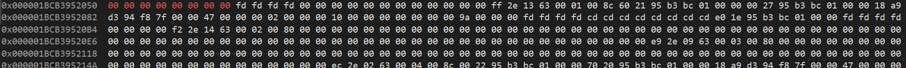
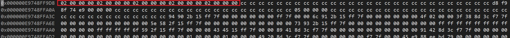
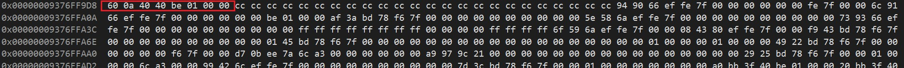
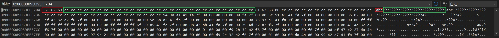
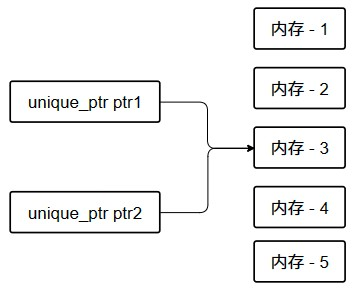

# Cherno C++

[TOC]

## 参考资料

教程源地址: [Youtobe](https://www.youtube.com/playlist?list=PLlrATfBNZ98dudnM48yfGUldqGD0S4FFb) The Cherno
中文翻译地址: [BiliBili](https://space.bilibili.com/364152971/channel/collectiondetail?sid=13909) 神经元猫
大佬笔记: [知乎](https://zhuanlan.zhihu.com/p/553387258) 萨达哈鲁

## 变量

位于内存中堆和栈上的**容器**.

不同变量(**原始数据类型**)的唯一区别是在内存中占用的大小.

`unsigned`取消符号,使原始数据类型仅表示**无符号**数据.

例如`int`表示的范围为$ 2^{31} $(约正负21亿),其中一位用作表示数据的正负,在`int`前加上`unsigned`表示数据的范围改为$ 2^{32} $(约42亿).

``` cpp
// 其他原始数据类型
// char,float,double,long,long int,bool, ...
```

`char`用于存储*单个字符*,字符使用数字来表示.

``` cpp
char a = 'A';
char b = 65;

std::cout<< a <<std::endl;
std::cout<< b <<std::endl;
```

输出结果

``` cpp
A
A
```

`float`与`double`用于存储浮点数,通常情况下,字面量浮点数的数据类型为`double`;在字面量后加`f`使其存储为`float`类型.

``` cpp
// 5.5  double
float variable_a = 5.5; // double
double variable_b = 5.5; // double
float variable_c = 5.5f; // float
```

`bool`**非零既一**,这里的非零既一并不是零或一,而是只要不是零都视为一.零代表**假**,一代表**真**.

使用`sizeof`查询数据类型所占的内存空间.

``` cpp
std::cout << sizeof(bool);
```

## 函数

函数是我们书写的**特定功能**的代码块,用于执行特定的任务,避免**代码重复**.

### 函数的声明与定义

``` cpp
int Multiply(int a, int b)
{
    return a * b;
}
```

- `int`的位置为**函数的返回值**,他的任务是告诉并规定该函数执行完需要返回一个`int`类型的值,如果希望不返回值或返回值为其他类型只要将其改为`void`或其他类型即可.
- `Multiply`为函数的标识符,标识符可以是任意名字,但最好的命名是使改名字具有意义,例如描述该函数的功能.
- `(int a, int b)`函数的参数列表,该函数需要什么数据;参数列表也可为空`()`.
- `{}`函数体,函数的内容,如果该函数有返回值,需要加上`return`语句,来返回最终处理的值.

### 函数的调用

``` cpp
int main()
{
    Multiply(3,4);
    std::cout<< Multiply(3,4) <<std::endl;
    int result = Multiply(3,4);
}
```

需要注意的使第一个,我们没有对返回的值进行储存等处理,最后返回的结果会被直接丢弃.

### main函数的int返回值

一个自定义函数如果表明了返回值类型,但没有返回相应类型的值,在编译时会产生报错(Debug模式下).

在一个程序中,只有主函数被豁免(不一定是main函数),它会自动假设你返回0.

## 头文件

``` cpp
// main.cpp

void Log(const char* message)
{
    std::cout << message << std::endl;
}

int main()
{
    Log("Hello World!"); // 正常调用
}
```

``` cpp
// 新建Log.cpp
void LogInit()
{
    Log("Log Init"); // 编译时报错,无法找到"Log"函数
}
```

我们需要**函数的声明**来告诉编译器`Log`函数确实存在,只不过他的定义在其他的文件.

``` cpp
// Log.cpp
void Log(const char* message);

void LogInit()
{
    Log("Log Init"); // 编译时报错,无法找到"Log"函数
}
```

程序正常运行,但如果我们在创建一个新的文件,意味着我们要**重复添加**函数的声明,尤其是在不止一个函数的时候,复制粘贴显得很麻烦,而且可读性也很糟糕;这个时候就需要使用头文件.

``` cpp
// 新建Log.h
#pragma once

void Log(const char* message);
```

``` cpp
// Log.cpp
#include "Log.h"

void LogInit()
{
    Log("Log Init");
}
```

程序正常运行.

现在在`mian`函数中无法使用`LogInit`函数,我们依旧可以使用头文件来解决问题.

``` cpp
// Log.h
#pragma once

void Log(const char* message);
void LogInit();
```

``` cpp {.line-numbers}
// main.cpp
#include <iostream>
#include "Log.h"

void Log(const char* message)
{
    std::cout << message << std::endl;
}

int main()
{
    std::cout << "Hello World!" << std::endl;
    std::cout << "--------------------" << std::endl;

    LogInit();
    Log("Hello World!");

    std::cin.get();
}
```

程序正常运行.

### #pragma once

用于防止**重定义**的出现,下述案例使用结构体演示

``` cpp
// Log.h
// #pragma once

void Log(const char* message);
void LogInit();

struct Player {};
```

``` cpp {.line-numbers}
// main.cpp
#include <iostream>
#include "Log.h"
#include "Log.h"

void Log(const char* message)
{
    std::cout << message << std::endl;
}

int main()
{
    std::cout << "Hello World!" << std::endl;
    std::cout << "--------------------" << std::endl;

    LogInit();
    Log("Hello World!");

    std::cin.get();
}
```

编译时报错,`Player`被重定义;但这种简单的错误我们正常是不会犯得,但如果换一种情况.

``` cpp
// 新建other.h
#include "Log.h"
```

``` cpp {.line-numbers}
// main.cpp
#include <iostream>
#include "other.h"
#include "Log.h"

void Log(const char* message)
{
    std::cout << message << std::endl;
}

int main()
{
    std::cout << "Hello World!" << std::endl;
    std::cout << "--------------------" << std::endl;

    LogInit();
    Log("Hello World!");

    std::cin.get();
}
```

编译时报错,`Player`被重定义;我们取消注释`#pragma once`,程序正常运行.

`#pragma once` 的功能与`#ifndef`相同.

``` cpp
// Log.h
#ifndef _LOG_H
#define _LOG_H

#include <iostream>

void Log(const char* message);
void LogInit();

struct Player {};

#endif
```

程序正常运行.

### <> 和 "" 的区别

<>用于表示绝对路径(编译器包含路径),""则表示相对路径.

`iostream`不带文件后缀是为了与C语言的头文件进行区分.

## 条件与分支

C++中并不包含`else if`关键字,他仅仅是将`else`与`if`写在同一行,是一种"小聪明".

在程序中我们应当避免使用**条件分支语句**它会拖慢程序的运行效率,我们应该使用一些数学运算来更好的优化代码.

## 循环

### for

``` cpp
// 通常写法
for (unsigned int i = 0; i < 5; i++)
{
    Log("Hello World!");
}
```

``` cpp
// 与上相同
unsigned int i = 0;

for ( ; i < 5; )
{
    Log("Hello World!");

    i++;
}
```

``` cpp
// 死循环
for ( ; ; )
{
    Log("Hello World!");
}
```

### while

``` cpp
unsigned int i = 0;

while(i < 5)
{
    Log("Hello World!");
    i++;
}
```

``` cpp
unsigned int i = 0;

do
{
    Log("Hello World!");
    i++;
}while(i < 5);
```

## 控制流语句

主要的控制流语句`continue`,`break`,`return`.

- `continue` : 结束当前循环,进入下一次循环迭代.
- `break` : 跳出循环.
- `return` : 结束当前所在的方法.

## 指针

一个指针,只是一个内存地址,仅此而已!

``` cpp {.line-numbers}
int var = 8;

void* ptr = 0; // 表示空指针,0对于内存地址是无效的
ptr = NULL;
ptr = nullptr;

ptr = &var; // 使用&获取变量的内存地址

std::cout << *ptr << std::endl; // 使用*访问指针存储的对象
```

``` cpp {.line-numbers}
int var = 5;

void* ptr = &var;
*ptr = 10; // 错误的,编译器无法知道指针类型,为变量分配内存

int* ptr = var;
*var = 10;
```

指针不是数据,我们不知道指针的大小.

``` cpp
char* buffer = new char[8];
memset(buffer, 0 ,8); // 为该指针指向的内存区域8个字节填充数据,数据为0.
```



这个语句向系统申请了8个字节的空间,并返回一个指向那块内存开始的指针.

``` cpp
char** ptr = &buffer;
```

双指针,指向另一个指针;指针本身是变量(对象).

## 引用

引用是引用现有变量的一种方式,他们并不占用内存;可以理解为变量访问的快捷方式(语法糖).

编译器在编译时会将引用优化成对应的变量.

声明一个引用时,应立即对其进行初始化.

``` cpp
int a = 5;
int& ref_a = a;

ref_a = 2;
```

``` cpp
void Increment(int value)
{
    value++;
}

int main()
{
    Increment(a);
    std::cout << a << std::endl;
}
```

上述案例的操作是将变量`a`的值赋予新的变量`value`,累加操作作用的是`value`;如果我们想对变量`a`进行累加第一种方法是我们可以使用指针.

``` cpp
void PointIncrement(int* value)
{
    (*value)++;
}
```

可以看出使用指针的方法很麻烦也不利于增强代码的可读性,使用引用可以更好的解决问题.

``` cpp
void RefIncrement(int& value)
{
    value++;
}
```

## 类

``` cpp {.line-numbers}
class Player // 一个类不标明可访问性时,默认为私有
{
public:
    int x, y;
    int speed;

    void Move(int xa, int ya)
    {
        x += xa * speed;
        y += ya * speed;
    }
};
```

## 类与结构体对比

在C++中区别于他们的可访问性,默认情况下`struct`的可见性是`public`,`class`的可见性是`private`;目的是向下兼容C语言.

### 如何选择

仅仅表示一些变量与结构时使用`struct`(例如数学中的向量).

希望表示更多功能或者有明确的继承关系使用`class`.

## 如何写一个C++类

以一个`Log`类为例,我们可以先认为类已经写完,看看我们需要什么功能.

``` cpp {.line-numbers}
Log log;
log.SetLevel(log.LogLevelWarning);
log.Error("Hello!");
log.Warn("Hello!");
log.Info("Hello!");
```

需求确定完成后,我们去完善我们的类.

``` cpp {.line-numbers}
class Log
{
public:
    const int LogLevelError = 0;
    const int LogLevelWarning = 1;
    const int LogLevelInfo = 2;

private:
    int m_LogLevel = LogLevelInfo;

public:
    void SetLevel(int level)
    {
        m_LogLevel = level;
    }

    void Error(const char* message)
    {
        if (m_LogLevel >= LogLevelError)
            LOG("[ERROR]: " << message);
    }

    void Warn(const char* message)
    {
        if (m_LogLevel >= LogLevelWarning)
            LOG("[WARNING]: " << message);
    }

    void Info(const char* message)
    {
        if (m_LogLevel >= LogLevelInfo)
            LOG("[INFO]: " << message);
    }
};
```

这样一个基本可用的类就编写完成了.

## 类和结构体外的静态

- 在类或结构体外部使用静态

这意味着你定义的函数和变量只对他声明所在的cpp文件(翻译单元.obj)是"可见"的.

- 在类或结构体内使用静态

此时表示静态变量所在的内存是所有类的实例共享的,静态变量的实例只有一个.

类中的静态函数也一样，静态函数中没有该实例的指针（this）。在类中没有实例会传递给该函数.

除非你真的需要,否则没必要将其设置为全局变量.

我们不能声明两个标识符相同的全局变量.

使用`extern`声明可以将一个变量改为另一个翻译单元的变量的引用.

``` cpp {.line-numbers}
// static.cpp中
int s_var = 5;

// main.cpp
extern int s_var;   //注意这里没有了赋值
int main(){
    std::cout << s_var << std::endl;
}

// 输出5
```

## 类与结构体内的静态

- **静态方法**不能访问**非静态成员**
- **静态方法没有类实例**
- 本质上在类中写的每个**非静态方法**都会获得当前类的实例作为参数.
- 静态成员在变量编译时存储在**静态存储区**,即**定义过程在编译时完成**,因此一定要**在类外进行定义**,但可以不进行初始化.静态成员变量是所有实例共享的;但是其**只在类中进行了声明,并未定义或初始化**(分配内存).类或者类实例就无法访问静态成员变量，这显然是不对的,**所以必须先在类外部定义**,也就是分配内存.
- 通过**类的实例引用静态成员是没有意义的**,在**静态函数中引用类的实例成员也是没有意义**的.

静态方法和在类外编写函数是一致的.

``` cpp {.line-numbers}
struct Entity
{
    int x;

    static void print()
    {
        cout << x << endl;  // 报错，不能访问到非静态变量x
    }
};
//在类外面写一个print()函数
static void print()
{
    cout << x << endl;  // 报错，x是什么？没被定义。
}
```

使用参数列表可以访问类的实例成员.

``` cpp {.line-numbers}
struct Entity
{
    int x;

    static void print(Entity e)
    {
        cout << e.x << endl;  // 报错，不能访问到非静态变量x
    }
};
```

## 局部静态

- 变量的生命周期指的是变量从创建到销毁之间的时间.
- 作用域指的是变量的可访问范围.

局部静态变量允许我们声明一个变量,它的生命周期相当于整个程序的生命周期,然而他的作用域却是局部的.

``` cpp {.line-numbers}
void Function()
{
    static int i = 0;
    i++;
    LOG(i);
}

Function();
Function();
Function();

// 输出结果为1,2,3
```

典型的案例还有单例类(该类有且只有一个实例)

``` cpp {.line-numbers}
// 不使用局部静态
class Singleton
{
private:
    static Singleton* s_Instance;
public:
    static Singleton& Get() { return *s_Instance; }
};

Singleton* Singleton::s_Instance = nullptr;
```

``` cpp {.line-numbers}
// 用局部静态
class Singleton
{
public:
    static Singleton& Get()
    {
        static Singleton instance;
        return instance;
    }
};
```

## 枚举

枚举只是将一些特定值进行命名的一种方式,最大的好处是他是已经归类好的了.

``` cpp {.line-numbers}
enum Example // 默认为Int类型的几何A = 0, B = 1, ...
{
    A, B, C
};

Example value = B;

if (value == B)
{
    // Do something here
}
```

``` cpp
enum Example : unsigned char
{
    A = 65, B, C
}
```

我们也可以更改其类型(类型必须为整数,例如float是不可行的).

我们可以修改完善Log类了.

``` cpp
enum Level
{
    Error = 0, Warning, Info
};
```

枚举并不是命名空间,不可以通过`::`访问其成员,它只属于所在的类.

## 构造函数

构造函数特殊的函数,他没有返回值,名字与类名保持一致.

它用于对我们的自定义类进行初始化.

其他语言可能会对基本类型进行初始化,但C++不会,你必须手动对他进行初始化.

如果你不指定构造函数,你仍然有一个构造函数,这叫做默认构造函数,是默认就有的.但是,我们仍然可以删除该默认构造函数.

``` cpp
// 默认构造函数
Entity() {}
```

``` cpp
Entity() = delete;
```

使用函数的重载可以为一个类创建多个构造函数.

构造函数会在创建实例时运行;所以如果你使用一个该类的静态函数,构造函数是不会执行的.

## 析构函数

当一个对象被销毁时调用析构函数;来清理内存.

析构函数同时适用于栈和堆分配的内存.

- 栈上的对象当超出其作用域时,对象会被删除,调用析构函数.
- 使用new关键字在在堆上创建对象,当使用delete关键字删除对象时,析构函数将会被调用.

!!!warning
    **析构函数没有参数列表,不能被重载**,因此一个类只有一个析构函数.
    不显式的定义析构函数系统会调用默认析构函数

## 继承

- 子类包含父类的一切
- 子类是父类的派生类,在子类中我们可以扩充新的变量与函数成员.
- 子类不论是父类的privtae,public,protected都会继承;需要注意的是:在子类的各个成员函数中,不能访问父类的private成员.

继承的格式

``` cpp
class 派生类名 : public 基类名
{

};
```

``` cpp {.line-numbers}
class Entity
{
public:
    float X, Y;

    void Move(float Xa, float Ya)
    {
        X += Xa;
        Y += Ya;
    }
};

class Player : public Entity
{
public:
    const char* Name;

    void PrintName()
    {
        LOG(Name);
    }
};
```

在上述例子中

- Player类不仅仅是Player类,他同时也是Entity类.,也就是说**它同时是两种类型**,我们可以在任何使用Entity的地方将其替换为Player.
- Player总是是Entity的超集.

## 虚函数

- 虚函数可以让我们在子类中重写方法
- 虚函数并不是"免费"的,他有额外的性能开销,但除非你为很差的平台编写程序,否则大部分情况下可以无视这些性能开销.

``` cpp 
class Entity
{
    virtual void Function()
    {

    }
};
```

案例

``` cpp
class Entity
{
public:
    std::string GetName() { return "Cherno"; }
};

class Player : public Entity
{
public:
    std::string GetName() { return "Player"; }
};

void PrintName(Entity* entity)
{
    LOG(entity->GetName());
}

Entity* e = new Entity();
PrintName(e);

Player* p = new Player();
PrintName(p);

// 输出结果
Cherno
Cherno
```

这并不是我们希望看到的,按照**多态**的思想,我们的代码是不合格的.

原因是在于如果我们在类中正常声明函数或方法,当调用这个方法的时候,他**总是会调用属于这个类型的方法**;它只会在Entity的内部寻找和调用GetName.

为了让我们达到多态的目的,此时虚函数可以处理这种情况.

- 虚函数引入了一种要动态分配的东西,一般通过虚表（vtable）来实现编译;虚表就是一个包含类中所有虚函数映射的列表,通过虚表我们就可以在运行时找到正确的被重写的函数.
- 如果你想重写一个函数,你必须要把基类中的原函数设置为虚函数.

``` cpp
class Entity
{
public:
    virtual std::string GetName() { return "Cherno"; }
};

class Player : public Entity
{
public:
    std::string GetName() override { return "Player"; }
};
```

对上面的案例进行如上修改,我们达到了多态的目的.

## 接口(纯虚函数)

纯虚函数强制子类实现基类的纯虚函数.

含有纯虚函数的类称为**抽象类**,他不能直接创建实例.

声明方法

``` cpp
virtual void Function() = 0;
```

- C++中纯虚函数本质上与其他语言(C#)中的抽象方法或接口相同.
- 纯虚函数与虚函数的区别在于只声明,但不实现;实现交给派生类来做.
- 继承纯虚函数所在的类的派生类必须实现所有的虚函数,否则将无法实例化.
- 其他语言有`interface`关键字,但C++没有,接口只是C++的类而已.
- 接口只是一个不包含函数实现的类,被当作模板类使用,所以我们无法创建他的实例.

``` cpp {.line-numbers}
class Printable
{
public:
    virtual std::string GetClassName() = 0;
};

class Entity : public Printable
{
public:
    std::string GetClassName() override { return "Entity"; }
};

class Player : public Entity
{
public:
    std::string GetClassName() override { return "Player"; }
};

Printable* e = new Entity();
Printable* p = new Player();

PrintName(e);
PrintName(p);

// 输出结果
Entity
Player
```

## 可见性

在C++中访问修饰符只有三个:`public`,`private`,`protected`.

可见性对于程序的实际运行,性能毫无影响,他只是来帮助我们来更好的维护我们的代码.

- `private` 只有**自身类与友元类**可以访问,子类不在其可访问的范围内.
- `protected` **自身类以及他的派生类可见**.
- `public` 都可访问.

## 数组

- C++数组是表示一堆相同类型变量的几何.
- 在Debug模式下C++会对数组越界行为进行提示,但在Release模式下,这意味着我们已经对不属于这个数组所在的内存进行修改了.

``` cpp
int a[5];

// 数组越界
a[5];
a[-1];
```

``` cpp
int example[5];

for (int i = 0; i < 5; i++)
    example[i] = 2;
```

我们通常使用循环来修改或访问数组.

数组的本质是整数指针(一个内存地址).

``` cpp {.line-numbers}
int example[5];
int* ptr = example;

for (int i = 0; i < 5; i++)
	example[i] = 2;

*(ptr + 2) = 5;
LOG(*(ptr + 2));

*(int*)((char*)ptr + 8) = 7;
LOG(*(int*)((char*)ptr + 8));

// 输出结果
5
7
```

上述案例可以很好的证明数组的本质是整数类型的指针.

### 栈数组和堆数组

!!!warning
    如果想返回函数内的数组,我们需要使用`new`关键字在堆上创建.

在堆上创建数组的好处是除非**程序结束**,或是**手动删除**,否则数组会一直存在在内存中.

#### 内存间接寻址

指针指向另一个保存着数据的地址(p->p->data).

我们在栈上创建数组,是内存直接寻址,我们可以直接查找到数据.

``` cpp {.line-numbers}
class Entity
{
public:
    int example[5]; //栈数组
    Entity()
    {
        for (int i = 0; i< 5;i++) 
             example[i] = 2;   
    }
};

int main()
{
    Entity e;

    std::cin.get();
}
```



然而我们在堆上创建数组时,是内存间接寻址,我们先是查找到存储数据的地址,再根据地址查找到数据.

``` cpp {.line-numebrs}
class Entity
{
public:
    int* example = new int[5];  //堆数组
    Entity()  
    {
        for (int i = 0; i< 5;i++) 
             example[i] = 2;   
    }
};

int main()
{
    Entity e;

    std::cin.get();
}
```



该内存存储的是数据存放的地址.

内存中查找上述地址可以找到数据.

### C++中的std::array

他是C++11标准库中的数据类型,很多人喜欢使用他来代替原生的数组,因为它可以记录数组大小以及边界检查.

实际上我们没有办法计算原生数组的大小,但可以通过一些办法知道大小(例如因为当你删除这个数组时,编译器要知道实际上需要释放多少内存).

### 计算原生数组的元素个数

永远都不要在数组内存中访问数组的大小,这很危险.

- 栈数组

``` cpp
int count = sizeof(a) / sizeof(int);
```

- 堆数组

在对堆数组进行相同的方法进行计算时,实际上得到的是指针的大小.

所以这个方法只适用于位于栈上的数组,但你不能永远相信这个方法.

## 字符串

字符串的本质是字符数组.

C++中双引号`""`中的即为字符串`const char*`,使用`char*`创建字符串编译器会自动在字符串末尾添加`0`(空终止符),而`cout`遇到空终止符就会停止输出.



红色为字符串以及对应的ASCII码,绿色为Debug模式下编译器插入守卫字符.

### std::string

引入`#include<string>`

- C++标准库里有个类叫`string`,实际上还有一个模板类`basic_string`;`std::string`本质上就是这个`basic_string`的`char`作为模板参数的模板类实例,叫模板特化;就是把char作为模板类`basic string`的模板参数，意味着char就是每个字符背后的的数据类型
- `string`有个参数接收char指针或者`const char`指针的构造函数.
- `std::string`的本质就是一个`char`数组和一些内置的函数.

``` cpp
// 基本使用
std::string name = "Cherno";
LOG(name.size());
```

### 追加字符串.

``` cpp
// ERROR
std::string m_name = "Cherno" + "Hello!";
```

上述案例的本质是两个字符串常量相加,常量是不可修改的,所以遍历器会报错,他们并不是真正的`string`.

``` cpp
// 解决方法 1
std::string m_name = "Cherno";

m_name += "Hello!";
// 解决方法 2
std::string m_name = srd::string("Cherno") + "Hello!";
```

### `string`的其他用法

``` cpp
// 查找字符串
bool contains = m_name.find("no") != std::string::npos;
```

## 字符串字面量

- 双引号内的就是字符串字面量
- 字符串字面量是存储在内存中的**只读部分**,不可对只读数据进行操作.
- 避免使用非`const char*`之外的字符串创建方式,不能舍弃`const`

``` cpp
char* name = "Cherno";
name[2] = 'a';
```

上述案例中两个语句都是错误的,这里我们主要分析第二句;这是一个未定义行为,你正在对一个**指针指向的只读的数据**进行修改.

如果我们想修改字符串我们要在定义时将其定义为数组而不是指针.

``` cpp
char name[] = "Cherno";

name[2] = 'a';
```

其他的字符串类型

> `char`是一个字节的字符,`char16_t`是两个字节(16bit)的字符(utf16),`char32_t`是四字节的字符(utf32),`const char`就是utf8,`wchar_t`和`char16_t`的区别在于,宽字符所占的内存大小由编译器决定,可能是1字节也可能是2字节甚至4字节,通常情况下不是2字节就是4字节.

``` cpp {.line-numbers}
const char* name = "cherno";
const wchar_t* name = L"cherno";
const char16_t* name = u"cherno";
const char32_t* name = U"cherno";
const char* name = u8"cherno";
```

### 在C++14

引入`using namespace std::string_literals;`

他给出了一些方便的字符串函数.

``` cpp
// 字符串拼接
std::string name = "Hello"s + "World!";
```

这里字符串字面量后面加上`s`,他是一个操作符函数,它实际上会返回一个标准的字符串对象(`std::string`)

``` cpp
// 忽略转义字符
const char* example = R"(line1)
line2
line3"

```

## const

`const`关键字不能在代码层面改变什么,他只是一个承诺

### 指针常量与常量指针

- 指针常量

不能修改指针指向的内存地址;在定义的同时必须初始化.

``` cpp
int* const a = new int;
*a = 1;
a = &b; // ERROR : 不能修改指针指向的地址
```

- 常量指针

不能修改指针指向的内存地址的内容,可以修改指针的指向

``` cpp
const int* a = new int;
*a = 2;
a = &b; // ERROR : 不能修改指针指向的内存地址
```

### const在类与方法中的应用

``` cpp {.line-numbers}
class Entity
{
private:
    int X{10}, Y{10};

public:
    int GetX() const
    {
        return X;
    }

    void SetX(int x)
    {
        X = x;
    }
};

void PrintEntity(const Entity& e)
{
    // e.Set();	ERROR
    LOG(e.GetX());
}

int main()
{
    Entity e;
    PrintEntity(e);
}
```

在类中的方法后加上`const`关键字,保证我们不会对类中的成员变量进行修改.

``` cpp
int GetX() const
{
    X = 10; // ERROR
    return X;
}
```

在方法的参数类表中使用;我们只能调用实例中带有`const`关键字的方法.

有的时候我们会为`Get()`方法设置两个版本;带const关键字,不带const关键字.

如果想让带有const关键字的方法修改变量,可以在允许修改的变量前使用`mutable`关键字标记成员变量.

## mutable关键字

- 与const关键字配合使用.
- lambda表达式.

学完lambda表达式后补充

## 成员初始化列表

- 成员初始化列表中需要按成员变量定义的顺序写.这很重要,因为不管你怎么写初始化列表,他都会按照定义类的顺序进行初始化.

> 使用成员初始化列表的一大好处是,代码风格简洁,避免性能浪费.

### 在构造函数中初始化类的成员的两种方式

- 使用构造函数,笨笨的一个一个对成员变量进行初始化.
- 使用初始化成员列表

``` cpp {.line-numbers}
class Example
{
private:
    std::string e_Name;

public:
    Example()
    {
        LOG("Creat a example" << e_Name);
    }
 
    Example(std::string name)
        : e_Name(name)  // 使用冒号后加成员变量的方式进行成员变量的初始化
    {
        LOG("Creat a example " << e_Name);
    }
};
```

我们应该尽可能的使用成员列表进行初始化操作,这不只是习惯上的问题,他还会节省性能的开支.

``` cpp {.line-numebrs}
class Example
{
private:
    std::string e_Name;

public:
    Example()
    {
        LOG("Creat a example" << e_Name);
    }
 
    Example(std::string name)
        : e_Name(name)
    {
        LOG("Creat a example " << e_Name);
    }
};

class Entity
{
private:
    std::string m_Name;
    Example e; // 第一次调用

public:
    Entity()
        : m_Name("Unknow")
    {
        e = Example(); // 第二次调用
    }

    Entity(std::string name)
        : m_Name(name),e(Example("one"))
    {
        // 使用成员初始化列表成功赋值且不调用构造函数.
    }

    void PrintName()
    {
        LOG(m_Name);
    }
};

int main()
{
    Entity e0;

    Entity e1("Cherno");

    std::cin.get();
}

// 输出结果
Creat a example
Creat a example
Creat a example one
```

上例中我们可以看出,使用初始化成员列表可以节省程序在性能上的开支,我们只调用了一遍`Example`的构造函数.

## 三元运算符

``` cpp {.line-numbers}
int player_Level = 2;
std::string game_Rank;

// 通常方法
if (player_Level > 1)
    game_Rank = "Master";
else
    game_Rank = "Beginner";

// 三元运算符
game_Rank = player_Level > 1 ? "Master" : "Beginner";
```

三元运算符可以让代码更简洁,运行速度更快.

三元运算符可以进行嵌套,但不推荐这么做,这么做会使代码的简洁性被破坏,就失去了使用三元运算的的意义.

## 创建并初始化C++对象

### 栈分配

``` cpp
Entity entity01;
Entity entity02("cherno");
```

几乎在任何时候在栈中分配都是最好的选择,他是最快且最受管控的方式.

### 堆分配

``` cpp
Entity* entity03 = new Entity();
Entity* entity04 = new Entity("cherno");
```

当对象太大时,或者需要认为的控制对象的声明周期,此时我们需要在堆上进行创建.

- 当我们调用new关键字时,实际上发生了在**堆上的内存分配**,我们**调用了构造函数**,new关键字实际上会返回对象在堆中的地址,这就是为什么我们会声明`Entity*`类型.
- 如果使用了new关键字来创建 对象,我们需要使用`delete`关键字来清除内存,否则会造成**内存泄漏**.

## new关键字

- new关键字负责寻找空闲内存进行分配,并调用对象的构造函数.
- 如果你使用new关键字来为数组分配内存,记得使用`delete[]`关键字来清除内存.
- new关键字返回的是对象所在内存的地址而不是对象本身.

``` cpp {.line-numbers}
int* a = new int;		// 分配4字节的空间
int* b = new int[50];	// 分配4 * 50字节的内存空间

delete a;
delete[] b;

Entity* e1 = new Entity;	// 我们不需要使用括号,因为它有默认的构造函数
Entity* e2 = new Entity[50];

delete e1;
delete[] e2;
```

``` cpp {.line-numbers}
Entity* e = new Entity();
// 使用malloc关键字分配内存,然后返回给我们空类型的内存地址
Entity* e = (Entity*)malloc(sizeof(Entity));
// new关键字调用了对象的构造函数,malloc关键字只是为对象分配了内存,但没有调用对象的构造函数.
delete e;
```

new的本质是像'+','-','*',...一样的关键字,这意味着你可以对他进行重载,改变他的定义.

new支持一种**placement new**的用法,它可以让开发者决定对象的内存来自哪里,这个过程中你并没有真正的分配内存.

``` cpp
int* b = new int[50];
Entity* e = new(b) Entity();
```

## 隐式转换与explicit关键字

### 隐式转换

隐式转换只能进行一次.

``` cpp {.line-numbers}
Entity entity_1(22);
Entity entity_2 = 22;

Entity entity_a("cherno");
// Entity entity_b = "cherno";	ERROR : 隐式转换只能进行一次
Entity entity_b = std::string("cherno");
```

我们应该避免这样使用隐式转化,它使代码的可读性大幅度降低.

### explicit关键字

- explicit关键字禁止了编译器的隐式转换.
- 数学运算中会常常使用;防止数字和向量进行比较.

``` cpp {.line-numebrs}
class Entity
{
    explicit Entity(bool attack)
        : m_Name("Unknow"), m_Age(-1), m_Attack(0) {}
};

int main()
{
    Entity e1(true);
    Entity e2 = "114514"; // ERROR : explicit关键字禁止了隐式转换
}
```

## 运算符极其重载

操作符的本质是函数;他代替操作符来帮助我们来执行一些操作.

运算符的重载允许我们重新定义操作符的行为.

!!!tip
    应该尽量少的使用运算符的重载,只在它非常有意义的时候使用.

接下来我们将使用向量(Vector2)来演示操作符的重载.

``` cpp {.line-numebrs}
struct Vector2
{
    float x, y;

    Vector2(float x, float y)
        : x(x), y(y) {}

    Vector2 Add(const Vector2& other) const
    {
        return Vector2(x + other.x, y + other.y);
        }

    Vector2 operator+(const Vector2& other) const
    {
        return Add(other);
    }

    Vector2 Multiply(const Vector2& other) const
    {
        return Vector2(x * other.x, y * other.y);
    }

    Vector2 operator*(const Vector2& other) const
    {
        return Multiply(other);
    }
};

int main()
{
    Vector2 position(0.0f, 0.0f);
    Vector2 speed(0.7f, 0.7f);
    Vector2 powerUp(1.0f, 1.0f);

    Vector2 result1 = position.Add(speed.Multiply(powerUp));
    Vector2 result2 = position + speed * powerUp;
}
```

使用操作符可以明显看得出比使用函数的方法更加直观.

### 左移操作符`<<`的重载

直接使用`cout`无法将我们自定义的数据打印

``` cpp
std::cout << result <<std::endl; // ERROR
```

> 左移`<<`操作符的类型为`std::ostream`.

``` cpp {.line-numbers}
// 左移操作符与Vector2没什么关系我们将他定义到结构体外
std::ostream& operator<<(std::ostream& stream, const Vector2& other)
{
    stream << other.x << ',' << other.y;
    return stream;
}

std::cout << result2 << std::endl;

// 数据结果
0.7,0.7
```

### bool操作符重载

这里以`==`和`!=`为例

``` cpp {.line-numbers}
struct Vector2
{
    bool operator==(const Vector2& other)
    {
    return x == other.x && y == other.y;
    }

    bool operator!=(const Vector2& other)
    {
    return !(*this == other);
    }
};
```

## this关键字

我们可以通关this关键字访问当前对象的成员.

`this`在一个cont函数中,this的本质是`const Entity* const`或是`const Entity`,在一个非`const`函数中他就是一个`Entity*`类型的.

``` cpp {.line-numbers}
class Example
{
private:
    int x, y;

public:
    Example(int x, int y)
    {
        /*x = x
            y = y 我们实际上并没有完成初始化操作,只是将其自身的值重新赋值给自身,
            相当于啥也没干*/

        this->x = x;
        this->y = y;

        Example* e = this;
        e->x = x;
    }

    int GetX() const
    {
        const Example* e = this;
        return e->x;
    }

    void PrintExample()
    {
        const Example& e = *this;   // 解引this
        std::cout << e.GetX() << std::endl;
    }
};
```

## 对象生存期(栈作用域生存期)

基于栈的对象在我们**离开作用域**的时候就会被摧毁,内存被释放;在堆上创建的对象只有在你**手动释放**或者**程序结束**才会被摧毁.

下面演示一个典型的错误.

``` cpp {.line-numbers}
int* CreatIntArray()
{
    int array[50];
    return array;
}

int main()
{
    int* a = CreatIntArray();
}
```

上述案例中在栈中创建的数组在执行到函数末尾的时候内存被释放,数组变量此时已经不存在了.

### 基于栈的变量的好处

可以帮助我们自动化代码;最简单的例子是**作用域指针**,他基本上是一个类,是**指针的包装器**,在构造时在堆上分配指针,在析构时释放指针.

对于大的对象,我们需要在堆上为其分配内存,但是同时希望在跳出作用域时释放他们;我们可以使用标准库中的`unique_ptr`指针来实现.

下面案例我们将自己手动实现作用域指针.

``` cpp {.line-numbers}
class ScopePtr
{
private :
    Example* m_Ptr;

public:
    ScopePtr(Example* ptr)
    : m_Ptr(ptr){}

    ~ScopePtr()
    {
        delete m_Ptr;
    }
};

int main()
{
    {
        ScopePtr example = new Example(1, 1);
    }
}
```

## 智能指针

智能指针的本质是原始指针的包装器,当你创建一个智能指针,它会调用new关键字为你分配内存,然后根据指针的不同来决定内存释放的时间.

优先使用`unique_ptr`,其次考虑`share_ptr`.

尽量使用`unique_ptr`,因为他的开销小的几乎可以忽略不记,但如果你需要在对象之间共享变量,记得改为`share_ptr`.

### unique_ptr的使用

- 使用智能指针前`#include<memory>`
- `unique_ptr`是作用域指针
- `unique_ptr`是**唯一的**,不可复制,不可共享.

!!!warning
    如果你复制了一个`unique_ptr`,会有两个指针,两个指针指着**相同的内存地址**,只意味着其中一个指针释放了,那么另一个也会释放.
    

- `unique_ptr`的构造函数实际是被`explicit`标记的,他禁止了构造函数的隐式转换
- 最好使用`std::unique_ptr<Entity> entity = std::make_unique<Entity>();`;因为如果构造函数碰巧抛出异常,不会得到一个没有引用而悬空的指针从而造成的内存泄露,它会稍微安全一点.
- `std::make_unique<>()`是在**C++14**中引入的,C++11并不支持.

``` cpp {.line-numebrs}
#include <memory>

class Entity
{
private:
    const std::string m_Name;

public:
    Entity()
        : m_Name("Unknow")
    {
        std::cout << "Created Entity" << std::endl;
    }

    void PrintName() const
    {
        std::cout << m_Name << std::endl;
    }
};

int main()
{
    {
        // std::unique_ptr<Entity> entity_a = new Entity(); 不能隐式转换
        std::unique_ptr<Entity> entity_b(new Entity()); // 可以但不建议
        std::unique_ptr<Entity> entity = std::make_unique<Entity>();

        std::unique_ptr<Entity> e = entity;
    }
}
```

### 共享指针`share_ptr`的使用

`share_ptr`的原理是使用**引用计数**

> 引用技术基本上是一个方法,可以跟随你的指针有多少个引用,一旦引用为0,他就会释放内存.

`share_ptr`需要一块额外的内存用于存储引用记数,当你创建一个`share_ptr`时它会做两次内存分配,首先调用`new`操作符为对象分配内存,然后为引用记数分配内存.

``` cpp {.line-numebrs}
{
    std::shared_ptr<Entity> shareE;
    {
        std::shared_ptr<Entity> shareEntity_a(new Entity()); // 同样不推荐
        std::shared_ptr<Entity> shareEntity = std::make_shared<Entity>(); // 推荐

        shareE = shareEntity;
    } // shareEntity已经超出生命周期但没有调用析构函数,因为shareE还存在,引用记数不为0
}// 析构被调用,shareE也超出了生命周期
```

### 弱指针`weak_ptr`

- 可以和`share_ptr`一起使用

`weak_ptr`可以被复制,但不会增加额外的控制块(内存)来控制记数,仅仅声明这个指针还"活着".

当你把share_ptr付给一个weak_ptr时,他不会增加引用记数,当你不关心对象的所有权,你只想存储他的引用.

``` cpp {.line-numbers}
{
    std::weak_ptr<Entity> e0;
    {
        std::shared_ptr<Entity> sharedEntity = std::make_shared<Entity>();
        e0 = sharedEntity;
    } //此时，此析构被调用，内存被释放
}
```

## 复制与拷贝构造函数

拷贝函数使用

``` cpp {.line-numbers}
T(const T& other); // 声明

T(const T& other){} // 定义

T(const T& other) = delete; // 禁用
```

``` cpp
int a{10};
int b = a;
b = 5;

LOG(a);
LOG(b);

// 输出结果
10
5
```

上述案例是我们希望的复制,我们进行的仅仅是值的复制,b并不是a(复制的是内存存储的值,而不是内存地址);我们称之为**深拷贝**.

``` cpp
int* a = new int(10);
int* b = a;
*b = 5;

LOG(*a);
LOG(*b);

delete a;

// 输出结果
5
5
```

上述案例中,我们进行的是内存地址的复制,两个指针指向**同一块内存区域**;我们称之为浅拷贝.

``` cpp {.line-numbers}
class String
{
private:
    char* m_Buffer;
    unsigned int m_Size;

public:
    String(const char* string)
    {
        m_Size = strlen(string);
        m_Buffer = new char[m_Size + 1];
        /*for (unsigned int i = 0; i < m_Size + 1; i++)
        {
        m_Buffer[i] = string[i];
        }*/
        memcpy(m_Buffer, string, m_Size);
        m_Buffer[m_Size] = 0;
    }

    ~String()
    {
        delete[] m_Buffer;
    }
};

int main()
{
    String string("cherno");
    String name = string;

    std::cin.get();
}
```

上述案例中,我们创建了一个自己的字符串类,但运行上述程序后,会发生异常;异常发生的原因是我们在复制的过程中发生了浅拷贝,在析构函数阶段发生了问题.

1. 当你创建一个类时,与构造函数相同,我们会有一个默认的拷贝构造函数.他进行的是**浅拷贝**.
2. `string`的`m_Buffer`与`name`的`m_Buffer`指向的是同一块内存地址.
3. 但程序结束阶段调用析构函数时,首先调用`string`的析构函数,`string`的`m_Buffer`指向的内存地址被释放,随后执行`name`的析构函数,由于这两个对象的`m_Buffer`指向的是同一块内存地址,所以`name`的`m_Buffer`早己经被释放了,`delete`关键字想释放内存,但那块内存已经释放了.

我们可以向最开始那样更改成员变量的值来证明复制的过程中发生了浅拷贝.

``` cpp {.line_numbers}
class String
{
    ...

    char& operator[](const unsigned int index)
    {
        return m_Buffer[index];
    }

    friend std::ostream& operator<< (std::ostream& stream, const String& string);
};

std::ostream& operator<< (std::ostream& stream, const String& string)
{
    stream << string.m_Buffer;
    return stream;
}

int main()
{
    String string("cherno");
    String name = string;

    name[2] = 'a';

    LOG(string);
    LOG(name);

    std::cin.get();
}
// 输出结果
charno
charno
```

以上可以看出复制过程中确实发生的是浅拷贝,而不是深拷贝.

让我们加上拷贝构造函数,让复制正确执行.

``` cpp {.line-numebrs}
class String()
{
    ...

    String(const String& other)
        : m_Size(other.m_Size)
    {
        m_Buffer = new char[m_Size + 1];
        memcpy(m_Buffer, other.m_Buffer, m_Size + 1);
    }

}

// 输出结果
cherno
charno
```

Cool!我们解决了问题,程序也不会报异常了.

!!!tip
    我们应该尽量(总是)用`const`引用变量.

## C++箭头操作符

- 箭头运算符必须是类的成员.
- 一般将 箭头运算符定义成`const`成员,这是因为与递增递减运算符不一样,获取一个元素并不会改变类成员的状态.

### 应用场景

- 用于调用成员.

``` cpp {.line-numebrs}
(*point).member;
point->member;
```

- 重载箭头操作符

我们与之前的作用域指针结合

``` cpp {.line-numbers}
class Entity
{
private:
    int x;

public:
    void Print()
    {
        LOG("Hello!");
    }
};

class ScopedPtr
{
private:
    Entity* m_Ptr;

public:
    ScopedPtr(Entity* entity)
        : m_Ptr(entity)
    {

    }

    ~ScopedPtr()
    {
        delete m_Ptr;
    }

    Entity* operator->()
    {
        return m_Ptr;
    }
};

int main()
{
    ScopedPtr entity = new Entity();

    entity->Print();

    std::cin.get();
}
```

这样我们自己完成的作用域指针就更完善了.

我们还可以将其改成const版本

``` cpp {.line-numbers}
const Entity* operator->() const
{
    return m_Ptr;
}
```

- 用于计算成员变量的偏移量

> `pointer->member`的原理实际是指针地址+成员偏移量所得到成员所在的内存地址进行访问的,所以我们将指针设为`nullptr`(0,空指针),就成为了0 + 成员偏移量.

``` cpp
int offset = (int)&(((Vector3*)nullptr)->x);

LOG(offset);
```

